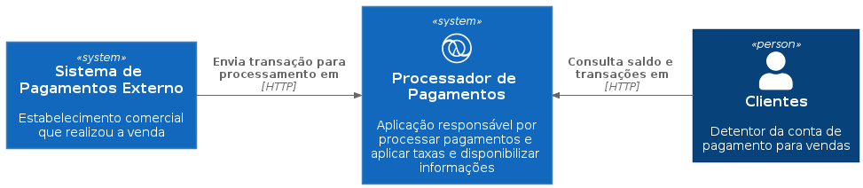
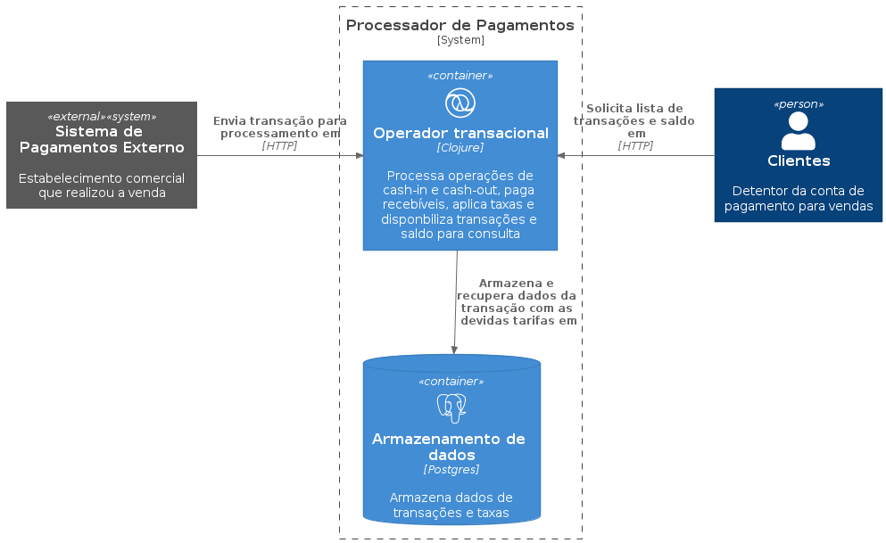
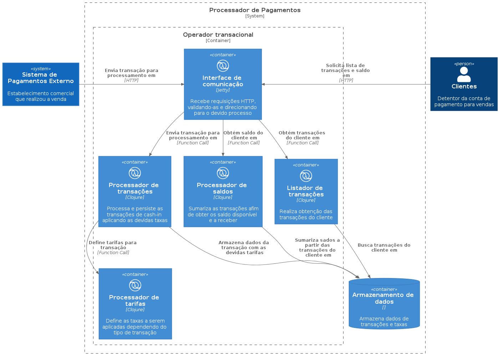

# me-paga-ai

Solução de pagamentos proposta pelo processo seletivo da pagar.me ([veja aqui][challenge-link]).

## Diagramas
**Sistema**

**Container**

**Componente**

## Bibliotecas, Frameworks e Ferramentas (Em decisão)
### Produção
- [Ring][ring]: Web Server baseado em Jetty
- [Reitit][reitit]: Melhor orquestração de rotas para Ring com tooling avançado
- [HoneySQL][honey-sql]: Gera SQL a partir de estruturas de dados
- [Next JDBC][next-jdbc]: JDBC otimizado em clojure
- [Malli][malli]: Validador de schemas

### Desenvolvimento e testes:
- [Matcher Combinators][matcher-combinators]: Melhor tooling para asserções nos testes
- [Kaocha][kaocha]: Runtime de testes pra clojure

## Uso
TO DO

## Opções
TO DO

## Exemplos
TO DO

### Bugs
TO DO

### Contribuidores

[Yuhri Bernardes][yuhri-profile] | [Rafael Dias][rafael-profile]

[challenge-link]: https://github.com/pagarme/vagas/blob/master/desafios/software-engineer-backend/README.md
[yuhri-profile]: https://github.com/yuhribernardes
[rafael-profile]: https://github.com/RafaDias

<!-- Repos -->
[ring]: https://github.com/ring-clojure/ring
[reitit]: https://github.com/metosin/reitit
[honey-sql]: https://github.com/seancorfield/honeysql
[next-jdbc]: https://github.com/seancorfield/next-jdbc
[malli]: https://github.com/metosin/malli
[matcher-combinators]: https://github.com/nubank/matcher-combinators
[kaocha]: https://github.com/lambdaisland/kaocha
