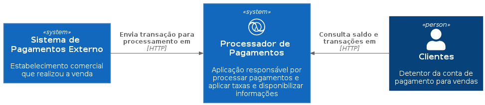
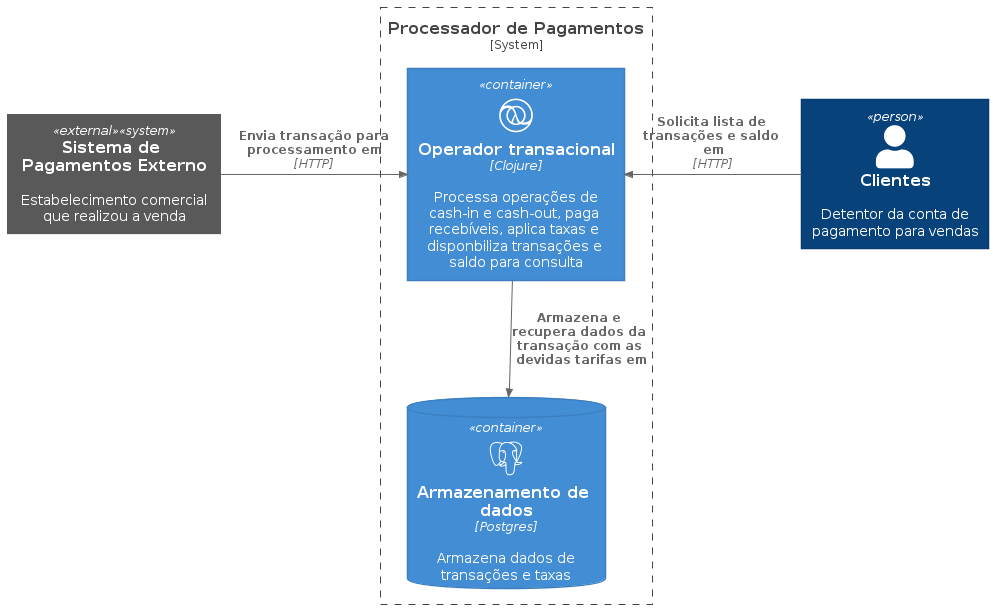
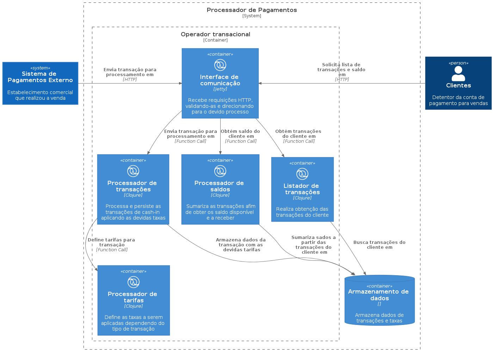

# me-paga-ai

Solução de pagamentos proposta pelo processo seletivo da pagar.me ([veja aqui][challenge-link]).

## Diagramas
**Sistema**

**Container**

**Componente**

## Bibliotecas e Frameworks
TODO

## Uso
TO DO

## Opções
TO DO

## Exemplos
TO DO

### Bugs
TO DO

### Contribuidores

[Yuhri Bernardes][yuhri-profile] | [Rafael Dias][rafael-profile]

[challenge-link]: https://github.com/pagarme/vagas/blob/master/desafios/software-engineer-backend/README.md
[yuhri-profile]: https://github.com/yuhribernardes
[rafael-profile]: https://github.com/RafaDias
